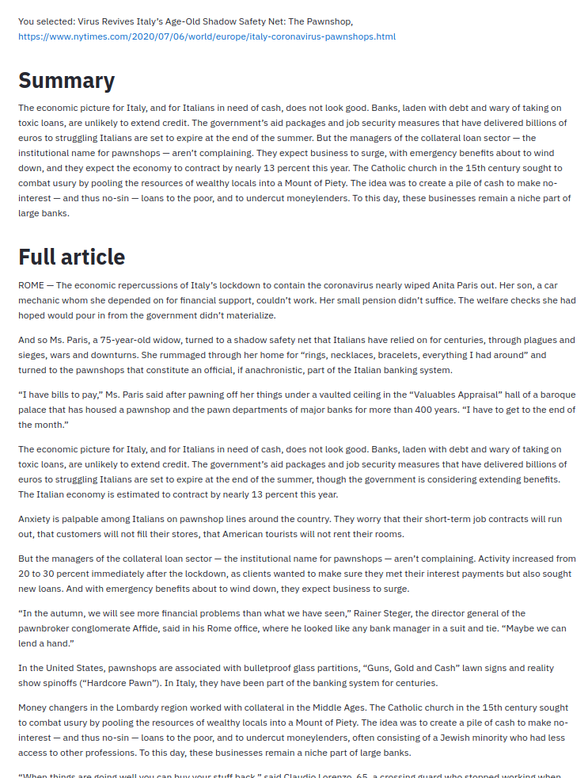

## Apps based upon HuggingFace API

### Contents

* [Summarization](#summarization)
* 

### Summarization

Applies Facebook's BART model, as implemented by HuggingFace, to summarize articles from the NY Times.

<table>
<tr valign="top">
<td>This is a streamlit app that does several things:

* uses the <em>NY Times</em> Top Stories API to get current metadata
* creates sidebar dropdown from top 5 URLs and titles
* when user selects a title:
  * fetches the article from <em>Times</em> website
  * extracts body of article using BeautifulSoup
  * body of article is truncated to a maximum of 720 words&dagger;
  * applies summarizer
  * displays summary
  * displays full article
  * displays profiling info
* Using streamlit's caching capabilities, most steps (fetching and extracting text from an article, for example) are repeated only as needed.

&dagger;Summarizer can fail if text is too long.

See [streamlitSummarizer.py](https://github.com/mw0/MLnotebooks/blob/master/HuggingFace/python/streamlitSummarizer.py) for source code.
</td><td width="743">
</tr>
</table>
