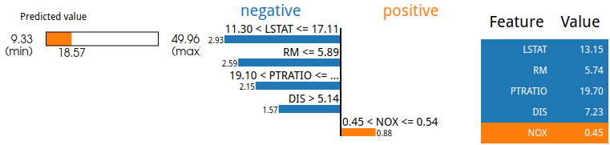

## Interpretable ML with SHAP and LIME

* [SHAP and LIME](#shap-and-lime)

### Shapley values

Shapley values &dagger; originate from cooperative game theory, and represent the contributions of a single player to the total payout of a game. This is computed for player *i* by examining the average of payouts for the games played by all coalitions (permutations) that can be formed by *excluding* player *i*.
(A simple example outside of game theory is the [Airport problem](https://en.wikipedia.org/wiki/Airport_problem).)
For the purposes of machine learning interpretation, make the substitutions: players ⟶ features, and payouts ⟶ model results.
The Shapley score then becomes a matter of computing the contribution of a feature *i* to a model result, by averaging results for the permutations of features where j ≠ i.
For examples, refer to &sect;5.9 of Christoph Molnar's [Interpretable Machine Learning](https://christophm.github.io/interpretable-ml-book/shapley.html#fn41).

To be more concrete, Shapley values are represented by force diagrams, which indicate how dominant features push the score of a data instance toward or away from the average score on a data set.
This is illustrated using the SHAP Python package for two input data points in a home price regression model using the classic Boston housing data set.
The average price (a long time ago!) in $1000s was 

### LIME

Local Interpretable Model-agnostic Explanations (LIME)&ddagger;:
to explain a single instance *Xi*, points *Xj* are sampled in the neighborhood of *Xi* and the black box model *f* is used to make a class prediction.
Given the individual feature value differences, *Δi*, and weighting these results by proximity values *πXj*, the impact of individual features can be estimated. Thes results are represented by the 

&dagger;[Shapley, Lloyd S. *A value for n-person games.* Contributions to the Theory of Games 2.28 (1953): 307-317](https://www.degruyter.com/view/books/9781400881970/9781400881970-018/9781400881970-018.xml)

Examples 

&ddagger;[Ribeiro, Marco Tulio, Sameer Singh, and Carlos Guestrin. “Why should I trust you?: Explaining the predictions of any classifier.” Proceedings of the 22nd ACM SIGKDD international conference on knowledge discovery and data mining. ACM (2016)](https://www.kdd.org/kdd2016/papers/files/rfp0573-ribeiroA.pdf)

These examples are from a modified Jupyter notebook provided by Domino Data Lab, described in their 14 Aug 2019 webinar.
Refer to [SHAPandLIME.ipynb](SHAPandLIME.ipynb) Jupyter notebook for additional plots and details.

#### Highlights:

* For the k-nearest neighbors model, computing Shapley values is prohibitive, due to the *k'(k' - 1)/2* distances that must be computed for each permutation of features left out; instead k-means values weighted by cluster size are supplied to `shap.KernelExplainer()`.
* Here, we provide a solution to a problem involving the XGBoost `.predict()` medthod. It requires DMatrix inputs, so a wrapper function inserting the data into a DMatrix is invoked when generating LIME plots.
* For XGBoost there are examples of how to export images (PNG files in this case) for both Shapley force plots and LIME bar plots.
