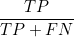
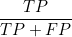

## Analyses of Confusion Matrices

This classifier model includes analyses of errors with the aid of three types of confusion matrices:

* [Counts](#Counts)
* [Precision](#Precision)
* [Recall](#Recall)

### Counts

This is a standard confusion matrix, with actual counts assigned to each class by the ground-truth target variable (`fda_q_fixed`) shown in rows, and model class predictions in columns.
Counts of true positives, with predicted and actual classes in agreement, are along the diagonal.

")

Direct application of this form of the confusion matrix is not very helpful, since it is dominated by the diagonal elements of the 4 largest classes &mdash; due to the strongly un-balanced classes.
After reviewing the Precision and Recall versions, we can use this to read-off counts for mis-classifications.

### Recall

This form of the confusion matrix is obtained by normalizing each *row* of the original matrix.
Those counts to the left or right of a given diagonal element show predictions for the corresponding class that the model incorrectly assigns to some other class, which is to say that they are false negatives.
The normalization by row then means dividing counts by all actual positives for the class &mdash; true positives and false negatives.
Each *diagonal* element then contains:

<!--
$$ \dfrac{TP}{TP + FN} $$
-->
&nbsp;&nbsp;&nbsp;&nbsp;&nbsp;&nbsp;&nbsp;&nbsp;&nbsp;&nbsp;&nbsp;&nbsp;

which is the definition of recall.

")

In this form, it's easy to spot low-precision scores as those diagonal elements far from red in color.
The contributions to these lower scores are seen as the same-row elements that have relatively high values.

Class 30 has a very low recall score (0.12), due to many instances being classified by the model as class 21, and other large mis-assignments to classes 28, 39 and 37.

### Precision

This form of the confusion matrix is obtained by normalizing each *column* of the original matrix.
Those counts above or below a given diagonal element show model predictions for the corresponding class that labels indicate belong to some other class, which is to say that they are false positives.
The normalization by column then means dividing counts by all counts the model attributes to the class &mdash; true positives and false positives.
Each *diagonal* element then contains:

<!--
$$ \dfrac{TP}{TP + FP} $$
-->
&nbsp;&nbsp;&nbsp;&nbsp;&nbsp;&nbsp;&nbsp;&nbsp;&nbsp;&nbsp;&nbsp;&nbsp;

which is the definition of precision.

")

In this form, it's easy to spot low-precision scores as those diagonal elements far from red in color.
The contributions to these lower scores are seen as the same-column elements that have relatively high values.

Most conspicuous here are classes 27 and 34, which have dismal precisions on account of misclassifications from classes 24 and 38, respectively.
(Class 7 has a modest precision on account of model mis-classifications from both class 5 and class 8.)
Note that classes 24 and 38 have respectable recalls, but due to their large sizes a small misclassification error can overwhelm true positives in much smaller classes.
