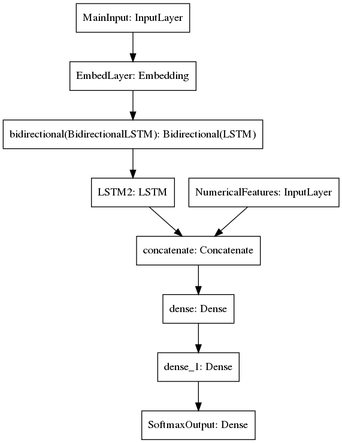

## Bidirectional LSTM Model

As previously, word sequences from comments are tokenized and down-cased, and a dictionary of word indices is created.
In this case the maximum vocabulary is set to some maxVocabCt (default: 80k), and low-frequency occurrences are removed.

Comments are truncated at some maximum length, maxCommentWords (default: 40), and pre-padded with 0s (not assigned to any word in dictionary) if shorter.
These vectors are fed into an embedding layer of size embeddingDim (default: 64), which in principle are learned as the model is trained.

Outputs from the embedding layer are passed to a bidirectional LSTM layer having internal activation layers of length LSTMlayerUnits (default: 64), and in the model design shown below, to a second LSTM layer.

As with other variants of this classifier, we need to select FDA violation codes based upon text-based descriptions from inspection reports, and from boolean values indicating whether or not the violation is critical.
From the exploratory data analysis, it became clear that for 8 codes these boolean values are exclusively True for False; they should have important predictive value.

This is accomplished by merging the boolean values after getting output features from the LSTM layer(s).
During backpropagation the model should learn how much to weight the booleans vs. the LSTM state vector values.

The concatenated vector + boolean, are passed to two dense layers of size denseLayerDim (default: 64).
Final outputs pass through a softmax layer with 56 outputs, which produces predicted probabilities for each class.
