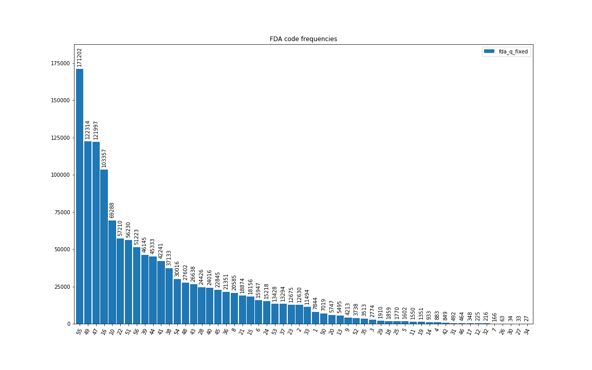
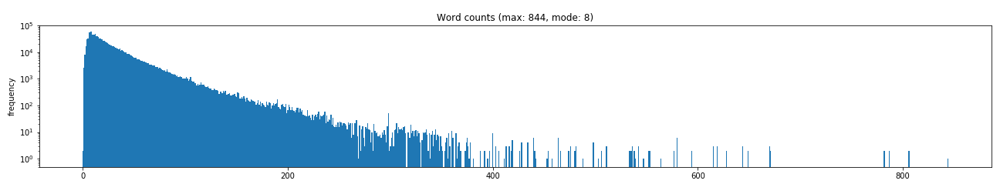

## Multi-Class Predictive Modeling Challenge

* The challenge was to build a classifier to select appropriate FDA food inspection violation codes from text descriptions, and from a boolean indicating whether the violation was critical.

### Contents

* [Initial look](#initial-look)
* [Preprocessing and feature construction](#preprocessing-and-feature-construction)
  * [Class splits and balancing](#class-splits-and-balancing)
  * [TF-IDF features](#tf-idf-features)
* [Basic model results](#basic-model-results)
  * ([analyses of confusion matrices](AnalysesOfConfusionMatrices.md))
* [Topic model feature results](#topic-model-feature-results)
  * ([topic model visualizations](TopicModelVisualizations.md))

### Initial look

* The classes represented by the 56 FDA codes were severely imbalanced, with 4 having fewer than 65 instances, and 4 having greater than 100k. (Minimum: 27, maximum: 171,202.)

* Four classes (7, 26, 27 & 29) were always critical violations, while four (30, 32, 34 & 46) never were critical violations. The `FDAISCRITICAL` boolean therefore is strongly predictive, at least for these classes, and should be included in models.

* Work was done on a notebook computer with 12 GB of memory, which was somewhat marginal for random forest models.

* Python code used mainly pandas, scikit-learn and gensim packages.

* Comments varied in length from 0 to 844 words (mode of 8) but only 1% had more than 140 words.

### Preprocessing and feature construction

#### Class splits and balancing

The very small classes had insufficient instances for statistically robust training or testing. The best possible is a 50-50 split. However, if the splitting is done randomly from the entire data set, there are no guarantees that the small classes would be evenly split. (There would be a 12% chance that random assignment would place more than 18 of 27 instances of the smallest class in the same test-train split.) For this reason, the splits were done individually for each class.

Manual balancing of classes was not needed, since the model algorithms each had a `class_weight='balanced'` option.

#### TF-IDF features

These were created for unigrams and bigrams using `scikit-learn`'s `TFIDFcountVectorizer()` (with `min document count=5`). No stemming or lemmatization was done. This lead to a large, but manageable&dagger;, count of features ~195k.

&dagger;It's worth noting that the random forest model consumed enough memory that swapping occurred.

For one model, `gensim` was used to construct unigrams and *commonly-occuring* bigrams by applying `gensim.models.phrases.Phrases()` and `gensim.models.phrases.Phraser()`.
By restricting bigrams to common occurrences, the total feature count was dramatically reduced to ~13k.

### Basic model results

Results obtained using the notebook [PredictiveModelingChallenge.ipynb](https://github.com/mw0/MLnotebooks/blob/master/multiClass/PredictiveModelingChallenge.ipynb) are shown in the first 4 lines of the table below.
After constructing the features (as one-hot encodings), the models used were linear regression, random forest, linear support vector machine, and complement naive Bayes.

Linear regression and linear support vector machine results were identical, while random forest performed moderately better.
Random forest used default parameters, except `n_estimators=180` and `max_depth=250`.
Due to swapping during  training (to flash, fortunately), the random forest results came at the expense of a training time that was multiples of those for the other two.
The complement naive Bayes model produces worse results than the three above it, but the training time is a very speedy 3 seconds.
In cases where f1 ~ 0.79 is acceptable, the training effort makes this a winner.

<table>
<tr><th rowspan=2>Model</th><th rowspan=2>Classifier</th><th colspan=2>Text Features</th><th colspan=3>Metrics</th><th rowspan=2>Minutes to train</th></tr>
<tr><th>TF-IDF</th><th>Topic model</th><th>precision</th><th>recall</th><th>f1</th></tr>
<tr><td>0</td><td>LR</td><td>&check;</td><td>&cross;</td><td>0.87</td><td>0.86</td><td>0.86</td><td>23</td></tr>
<tr><td>1</td><td>RF</td><td>&check;</td><td>&cross;</td><td>0.89</td><td>0.89</td><td>0.89</td><td>190&ddagger;</td></tr>
<tr><td>2</td><td>LSVC</td><td>&check;</td><td>&cross;</td><td>0.86</td><td>0.86</td><td>0.86</td><td>42</td></tr>
<tr><td>3</td><td>CNB</td><td>&check;</td><td>&cross;</td><td>0.80</td><td>0.79</td><td>0.79</td><td>0.05</td></tr>
<tr><td>4</td><td>LR</td><td>&cross;</td><td>&check;</td><td>0.42</td><td>0.40</td><td>0.38</td><td>128 + 7</td></tr>
</table>

&ddagger;Swapping to flash drive slowed down this training substantially.

Overall, the results from the 4 models using TF-IDF features, and the `FDAISCRITICAL` boolean, provide compelling results on the test data, when keeping in mind that for each class there are 55 *incorrect* classifications.
(But see the [analyses of confusion matrices](AnalysesOfConfusionMatrices.md).)

### Topic model feature results

Model 4 in the table above is substantially different from models 0-3. I was curious to see if topic model weights could be used as features for a logistic regression classifier.
I used `gensim`'s Latent Dirichlet Allocation model to get topic and document weights from the TF-IDF encoded messages.
Starting with a guess of 10 topics, the `pyLDAvis` inter-topic distance visualizations showed a couple cases of overlapping classes. This lead me to reduce the topic count to 8, which look good in the [topic model visualizations](TopicModelVisualizations.md).

In the end, the separation into what appeared to be well-separated LDA topics was anything but an improvement; the logistic regression classifier obtained relatively poor results.

*As an initial guess, I would say that the substantial reduction in dimensionality to 9 features from 13k resulted in too much information loss.*
