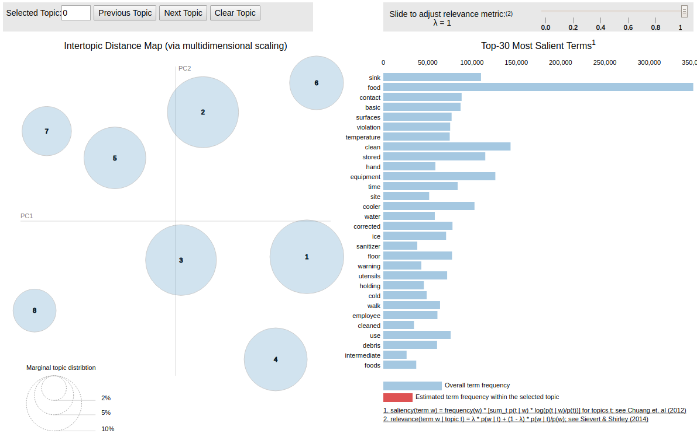
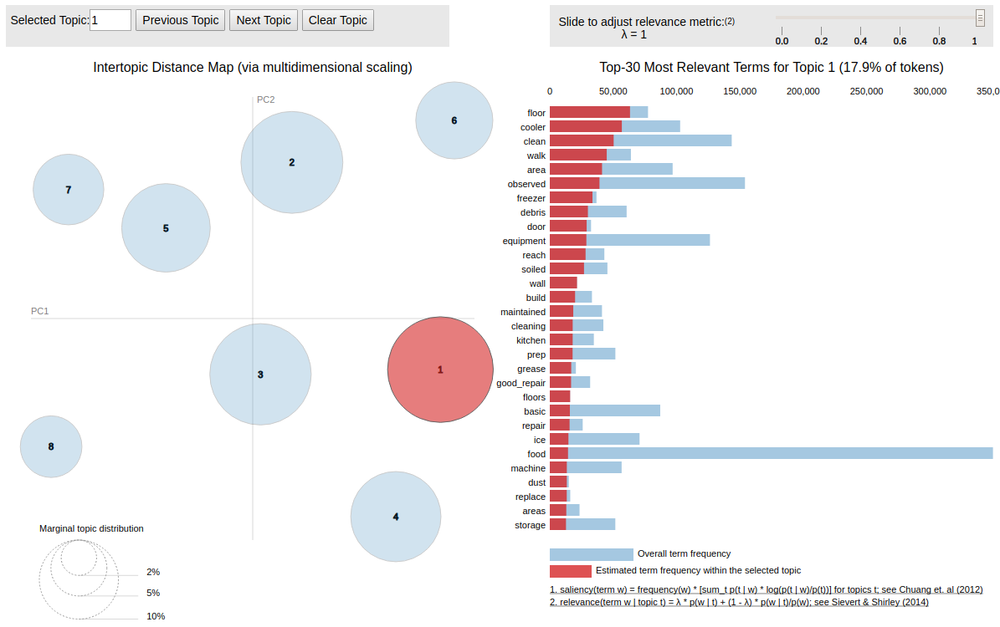
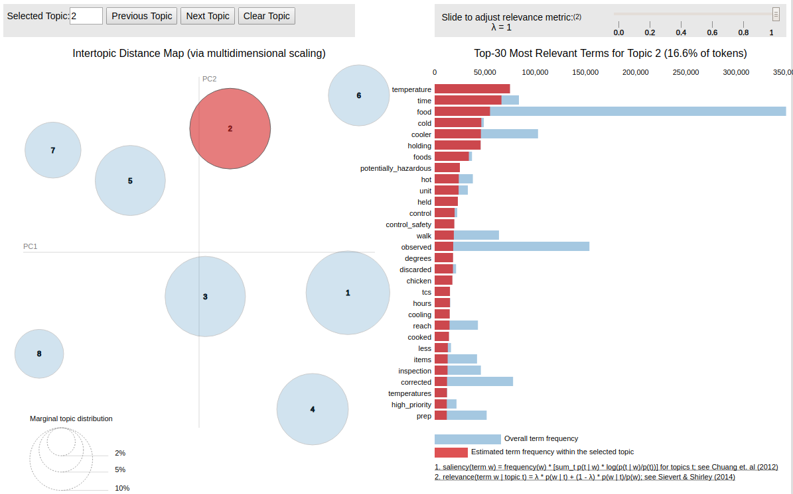
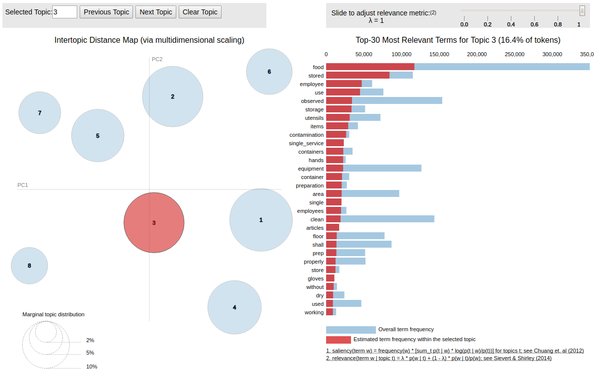
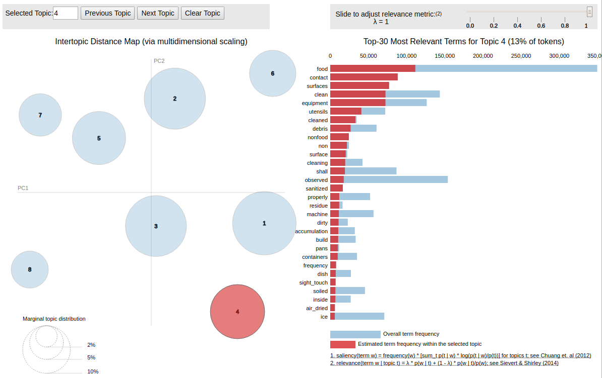
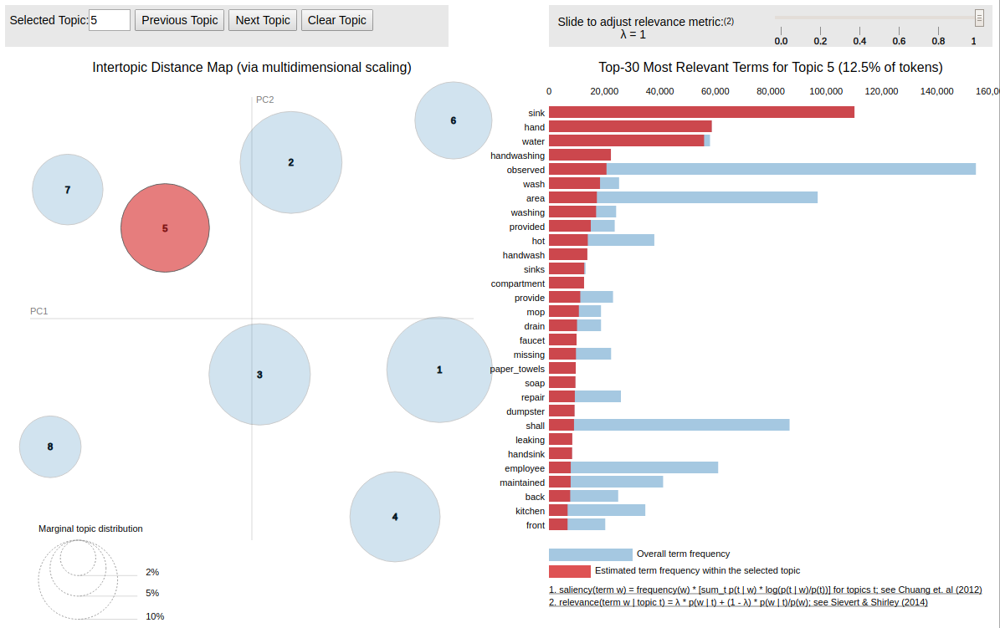
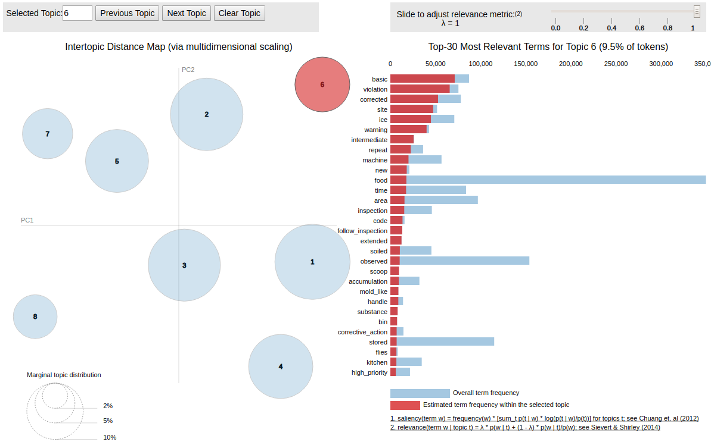
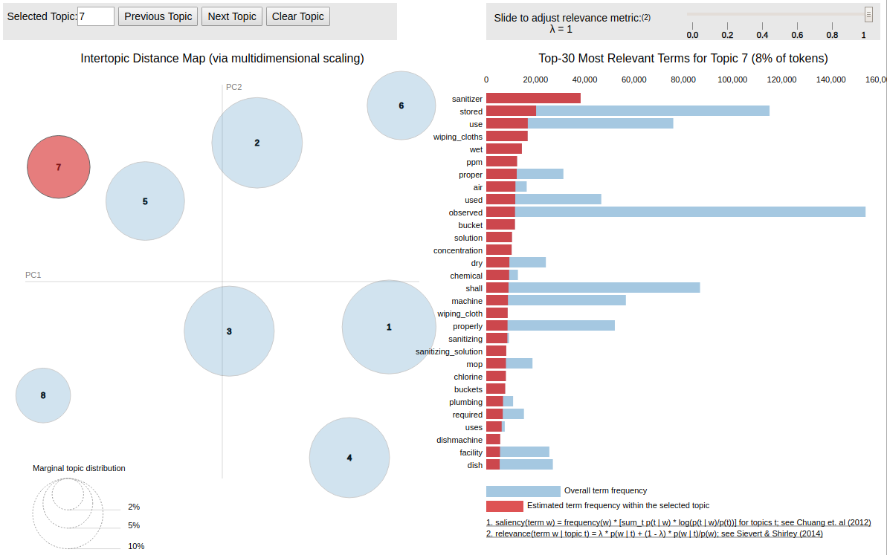
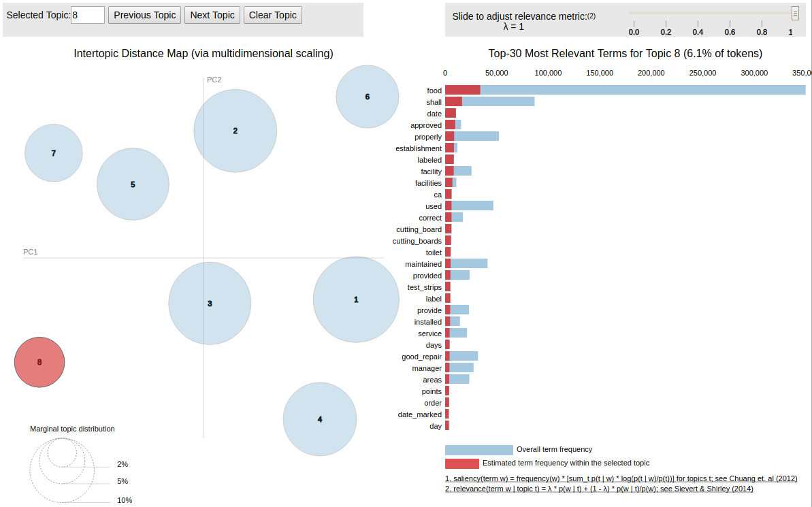

## Topic model visualizations

The best-seeming LDA topic model results (from all of two attempts) arose when setting the topic number to 8.
The visualizations below were obtained using `pyLDAvis`.

The first panel represents all topics in an inter-topic distance visualization, using dominant principle component axes.
These show very good inter-topic separation &mdash; which is surprising, given that I would expect food inspection report comments to have many overlapping terms. Of course, projections onto less-significant PCA components would reveal overlap not seen here.

Below are plots of the same for individual topics, and the associated word frequencies:

