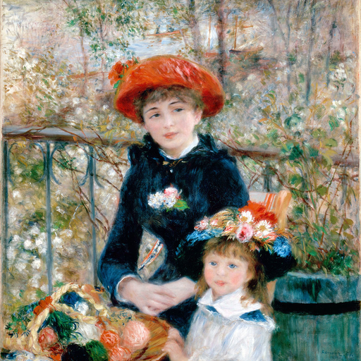
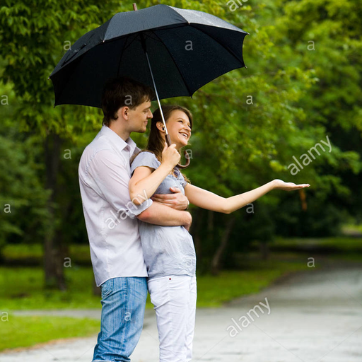
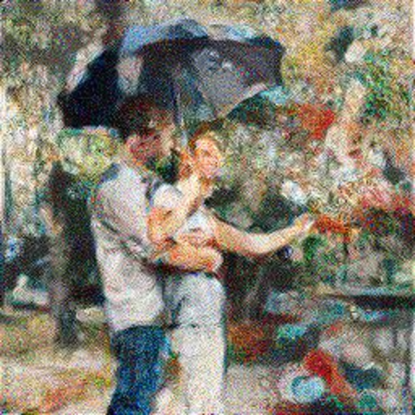

## Making Your Transfer Stylish

**Mark Wilber**

I present here examples of style transfer using the method proposed by [Gatys, L.A., et. al., *Image style transfer using convolutional neural networks*, CVPR 2016](http://openaccess.thecvf.com/content_cvpr_2016/html/Gatys_Image_Style_Transfer_CVPR_2016_paper.html).

**The big idea:**
A third image is generated from a "content" image and a "style" image.
The content image contains the scene you want rendered, while the style image exhibits the style in which you want the generated image rendered.
See [Examples](#examples) for illustrations of the results.

### Contents

* [Overview](#overview)
* [Mathematics](#mathematics)
* [Examples](#examples)
  * [Woman and man under umbrella, stylized by Renoir's *The two sisters on the terrace*](#woman-and-man-under-umbrella-stylized-by-renoirs-the-two-sisters-on-the-terrace)
  * [Kolkata children, stylized by Bonnie Wilber's porch scene](##kolkata-children-stylized-by-bonnie-wilbers-porch-scene)
  * [Kolkata children, stylized by Bonnie Wilber cat Mimi](##kolkata-children-stylized-by-bonnie-wilbers-cat-mimi)
* [About the code](#about-the-code)
* [References](#references)

### Mathematics

### Examples

#### Woman and man under umbrella, stylized by Renoir's *The two sisters on the terrace*

In this example, Renoir's *The two sisters on the terrace* is the style file.
The content file is a stock photo of a woman and a man under an umbrella.

|Style file|Content file|
|-------------|------------|
|||
|Generated image|Animation|
|||

It's interesting how the stylized version seems to have flowers from the younger sister's basket where the original content file has a road.

The animation shows how, through a series of 750 iterations, a third image, starting as random noise, is transformed into the final form as the algorithm tries to minimize the difference between the large-scale features in the content file and the style features of the style file.
(Reload the page if you want to see the  animation again after it has stopped.)

*In actuality, the generated images are only 256 &times; 256 pixels. My GPU only has 2 GB of memory, and even those dimensions were a stretch for it.*

### About the code

Much of the code is derived, initially, from Walid Ahmad's [Making AI Art with Style Transfer using Keras](https://medium.com/mlreview/making-ai-art-with-style-transfer-using-keras-8bb5fa44b216).

### References:

Answer to Quora question [In a neural style transfer, why does using Gram matrices keep the style?](https://www.quora.com/In-a-neural-style-transfer-why-does-using-Gram-matrices-keep-the-style)

[Li, Y. et. al., *Demystifying Neural Style Transfer*, arXiv:1701.01036v2, 2017](https://arxiv.org/abs/1701.01036)
